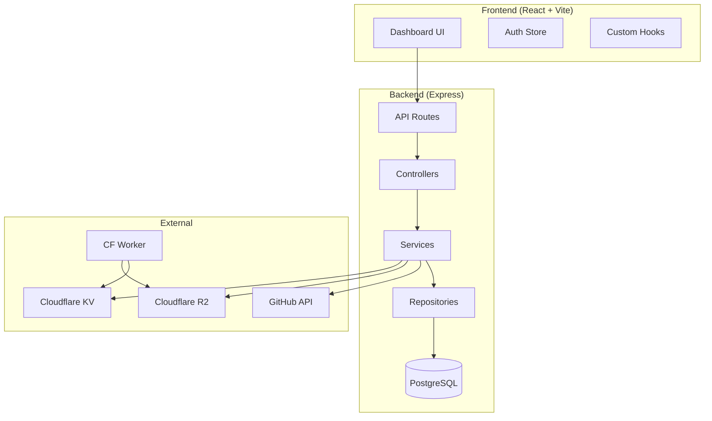
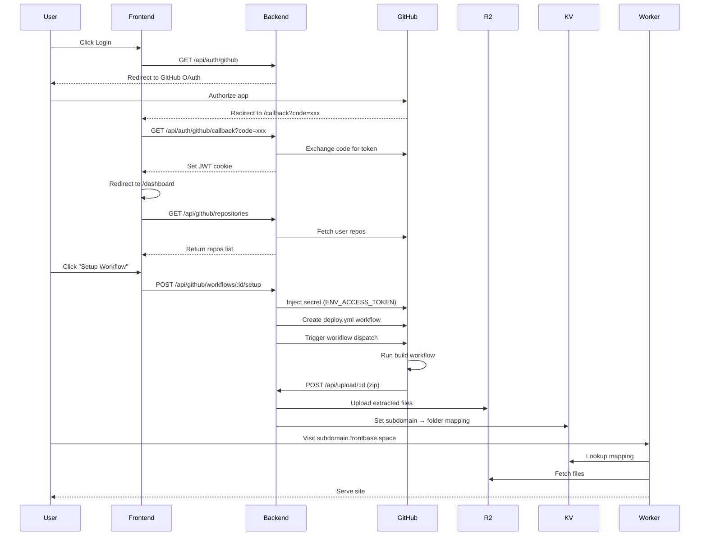

# Frontbase Frontend

**Frontbase** is a platform for deploying static frontend projects to the edge. Connect your GitHub, select a repository, configure your build settings, and deploy to Cloudflare's global network with a unique subdomain.

**This repo** contains the React dashboard where users manage their deployments.

- Backend repo: [Frontbase-Backend](https://github.com/Vijay-papanaboina/Frontbase-Backend.git)
- Cloudflare Worker repo: [frontbase_cloudflare_worker](https://github.com/Vijay-papanaboina/frontbase_cloudflare_worker)

## Features

- GitHub login via OAuth
- Repository list with deployment status
- One-click workflow setup (injects GitHub Action)
- **Environment variables** - Set build-time env vars per repo (injected into the workflow)
- Deployment status polling and details
- Responsive UI with dark theme

## Design Decisions & Trade-offs

| ✅ Advantages                                                      | ⚠️ Trade-offs                                                          |
| ------------------------------------------------------------------ | ---------------------------------------------------------------------- |
| **Zero build costs** - Uses GitHub Actions (free for public repos) | **Workflow injection** - Creates files in user's repo                  |
| **Unlimited builds** - No server limits                            | **Secret injection** - Adds `ENV_ACCESS_TOKEN` to repo secrets         |
| **Familiar CI/CD** - Users see builds in their Actions tab         | **Public repos only** - By design, to minimize security exposure       |
| **Scalable** - GitHub handles compute                              | **Requires user trust** - Users grant `public_repo` + `workflow` scope |

> **Why public repos only?** Since we inject workflows and secrets into user repositories, limiting to public repos reduces the security surface. Users can inspect the workflow file we create and understand exactly what runs.

> **Why inject a secret?** The workflow needs to authenticate with our backend to upload built files. The injected `ENV_ACCESS_TOKEN` allows secure uploads to `POST /api/upload/:id`.

## Architecture



### Deployment Flow



### Directory Structure

```
frontend/
  src/
    components/
      EnvDialog.jsx        # Environment variables modal
      RepoCard.jsx         # Mobile repo card
      RepoTable.jsx        # Desktop repo table
      RepoStatus.jsx       # Deployment status badge
      Header.jsx, Sidebar.jsx, Layout.jsx
      ui/                  # Shadcn atomic UI components
    pages/
      Dashboard.jsx        # Main repo list & workflow setup
      DeploymentsPage.jsx  # All deployments
      DeploymentDetails.jsx
      Login.jsx
      callback.jsx         # OAuth callback handler
      ProtectedRoute.jsx   # Auth guard
    store/
      auth.js              # Zustand auth state
    hooks/
      useRepos.js          # Repository fetching hook
      useDeployments.js    # Deployment polling hook
      use-mobile.js        # Mobile detection
    config/
      frameworks.js        # Build framework definitions
    lib/
      utils.js             # Utility functions
    App.jsx                # Route definitions
    main.jsx               # React entry point
  vite.config.js
  vercel.json              # SPA rewrites
```

## Free Tier - No Cost to Run

| Service            | Free Quota                                |
| ------------------ | ----------------------------------------- |
| GitHub Actions     | Unlimited (public repos)                  |
| Cloudflare R2      | 10 GB storage, 1M writes, 10M reads/month |
| Cloudflare KV      | 1 GB storage, 100K reads/day              |
| Cloudflare Workers | 100K requests/day                         |

> See [Backend README](https://github.com/Vijay-papanaboina/Frontbase-Backend#getting-your-api-keys) for step-by-step key setup.

## Quick Start (Full Stack)

### Prerequisites

- Node.js 18+
- PostgreSQL database
- GitHub OAuth App ([setup guide](https://github.com/Vijay-papanaboina/Frontbase-Backend#1-github-oauth-app))
- Cloudflare account ([setup guide](https://github.com/Vijay-papanaboina/Frontbase-Backend#2-cloudflare-r2-bucket))
- **Domain name** (to serve deployed sites via the Worker)
  - 💡 _Tip:for practice, you can get a domain for ~$1/year from registrars like Hostinger, Namecheap, Porkbun_

### 1. Clone Both Repos

```bash
mkdir frontbase
cd frontbase
git clone https://github.com/Vijay-papanaboina/Frontbase-Backend.git backend
git clone https://github.com/Vijay-papanaboina/Frontbase-Frontend.git frontend
```

### 2. Setup Backend

```bash
cd backend
npm install
cp .env.example .env
# Edit .env with your credentials (see backend README)
npx drizzle-kit push
npm run dev
```

### 3. Setup Frontend

```bash
cd ../frontend
npm install
echo "VITE_BACKEND_URL=http://localhost:3000" > .env
npm run dev
```

### 4. Configure GitHub OAuth

In your GitHub OAuth App settings:

- **Homepage URL**: `http://localhost:5173`
- **Callback URL**: `http://localhost:5173/callback`

## Environment Variables

| Variable           | Description          | Example                 |
| ------------------ | -------------------- | ----------------------- |
| `VITE_BACKEND_URL` | Backend API base URL | `http://localhost:3000` |

## Deployment (Vercel)

1. Add environment variable: `VITE_BACKEND_URL`
2. Ensure backend CORS allows the deployed frontend origin
3. `vercel.json` includes SPA rewrite (all paths → `/`)

## Troubleshooting

| Issue                  | Solution                                                |
| ---------------------- | ------------------------------------------------------- |
| CORS / 401 errors      | Check `VITE_BACKEND_URL` and backend CORS allowlist     |
| Cookies not sent       | Ensure `credentials: "include"` and HTTPS in production |
| Blank route on refresh | Verify `vercel.json` is deployed                        |

## Cross-Links

- **Backend**: https://github.com/Vijay-papanaboina/Frontbase-Backend.git
- **Cloudflare Worker**: https://github.com/Vijay-papanaboina/frontbase_cloudflare_worker

## License

MIT
